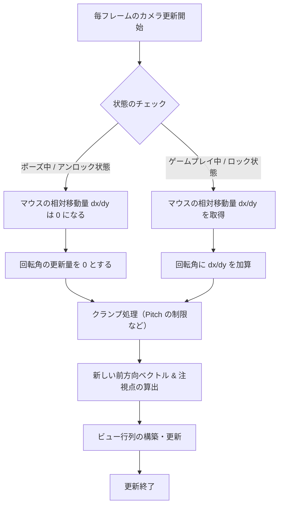

# マウスとカメラの理想的な実装フロー

3Dゲーム（特にFPSやTPSカメラ操作を行うゲーム）における、マウス制御とカメラ動作の理想的な設計および実装フローについて解説します。

---

## 1. 設計思想 ― 絶対座標と相対座標の明確な分離

マウスの入力データは、**使用目的によって必要な性質が根本的に異なります**。

| 用途 | 必要なデータ | 望ましい挙動 |
| :--- | :---: | :--- |
| UI操作（ボタンホバー・クリックなど） | **絶対座標**（ウィンドウ内のピクセル位置） | OSやウィンドウシステムと連動し、カーソルが画面内を自由に動く |
| カメラ操作（視点回転など） | **相対移動量**（前フレームからの変化量・デルタ） | カーソルが画面端で止まらず無限に回転し続けるため、カーソル自体は画面中央にロック・非表示にする |

> [!WARNING]
> これらを単一の `x`/`y` 変数で使い回すと、モード変更（ポーズ画面の開閉など）の際に入力の誤認や蓄積が発生し、**カメラが吹き飛ぶ・高速回転する・UIが動かなくなる**といった不具合の原因になります。

**推奨**: データ構造（`Mouse_State`）のレベルで、**絶対座標 (`x`/`y`)** と **相対移動量 (`dx`/`dy`)** を完全に独立させて定義することが理想です。

---

## 2. マウスモジュールの実装フロー

マウスモジュール（`mouse.cpp` 等）は、以下のライフサイクルと状態管理を行います。

### ① 初期化（Initialize）

- アプリケーション起動時、**生入力（Raw Input）** を登録してデバイスからの直接的な入力量を監視します。
- 初期モードは通常 **絶対座標モード（ABSOLUTE）** とします。

### ② モード遷移制御（SetMode）

**🔒 相対座標モード（RELATIVE / ロック時）**

```
ShowCursor(FALSE)       // カーソルを非表示
ClipCursor(rect)        // ウィンドウ矩形内に閉じ込める
→ 毎フレーム、ウィンドウ中央にカーソルを引き戻す（または Raw Input を処理する）
```

**🔓 絶対座標モード（ABSOLUTE / アンロック時）**

```
ClipCursor(nullptr)     // カーソル制限を解除
ShowCursor(TRUE)        // カーソルを表示
dx = dy = 0             // ★相対移動量を強制リセット（重要）
```

### ③ 毎フレームの更新（Update / ProcessMessage）

| モード | `x`, `y` | `dx`, `dy` |
| :--- | :--- | :--- |
| **絶対座標モード** | `WM_MOUSEMOVE` から取得した座標を代入 | 常に `0` に保つ |
| **相対座標モード** | `0` または無効値 | `WM_INPUT`（Raw Input）から取得したデルタ値を蓄積。読み取られたら次フレームまで `0` にリセット |

---

## 3. カメラ制御の実装フロー

カメラ（`camera.cpp`, `debugcamera.cpp` 等）は、マウスの状態を受け取って次のように動作します。



### ① 更新処理（Update）

**Step 1. マウス状態の取得**

```cpp
Mouse_GetState(&state);
```

**Step 2. 回転量の計算**

```cpp
yaw   += state.dx * sensitivity;
pitch += state.dy * sensitivity;
```

> [!TIP]
> モード判定をカメラ側で行わなくても、マウスモジュール側で「アンロック時は `dx = dy = 0`」が保証されていれば、カメラ側は安全に加算処理だけ記述できます。

**Step 3. Pitch のクランプ**

```cpp
pitch = std::clamp(pitch, -89.0f, 89.0f);
```

不自然な「首がちぎれる」挙動を防ぐため、上下角を `-89° 〜 89°` に制限します。

**Step 4. 注視点（At）とビュー行列の更新**

更新された Yaw / Pitch から前方ベクトル（Forward Vector）を算出し、カメラ位置（Pos）に足して注視点（At）を求め、ビュー行列を構築します。

---

## 4. ロック・アンロック（ポーズ切り替え）のシーケンス

ゲームプレイとメニューの往来では、以下の順序で制御を行うことで、**入力の取りこぼしや一瞬のカメラのチャタリング**を防ぐことができます。

### ゲームプレイ → ポーズ画面（アンロック時）

```
1. ゲームループを「ポーズ状態」に切り替える
2. UnLockMouse() を呼び出す
   ├─ マウスカーソルを可視化
   ├─ 絶対座標モードへ移行
   └─ ★ dx, dy を 0 にリセット（重要）
3. UIシステムが x, y を使ってホバー等の衝突判定を開始
   └─ カメラ更新が動いていても dx = dy = 0 なのでカメラは静止
```

### ポーズ画面 → ゲームプレイ（ロック時）

```
1. ポーズ画面を閉じる
2. LockMouse() を呼び出す
   ├─ マウスカーソルを非表示化
   ├─ 相対座標モードへ移行
   └─ （オプション）最初の 1〜2 フレームの入力を強制スキップ
         └─ 移行直後は大きなデルタ値が出やすいため、バッファ処理で安定化
3. カメラが dx, dy に基づいて視点移動を再開
```

---

## まとめ

今回のリファクタリングで適用した設計は、この理想的なフローに準拠しています。

| 観点 | 内容 |
| :--- | :--- |
| **データ構造の分離** | `Mouse_State` に `x`/`y`（絶対）と `dx`/`dy`（相対）を独立定義 |
| **カプセル化** | マウスモジュール自身が「絶対座標モード中は相対移動量を `0` にする」責任を持つ |
| **シンプルな呼び出し** | カメラ側は複雑な状態チェックを行わず、単純に `dx`/`dy` を加算するだけで安全に動作 |

> [!NOTE]
> この設計を維持することで、将来新しいカメラ（デバッグカメラ・カットシーンカメラ・イベントカメラなど）を追加した際にも、同様の不具合が再発するのを防ぐことができます。
